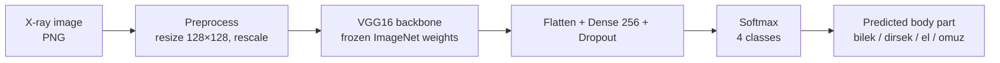
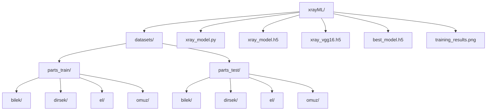
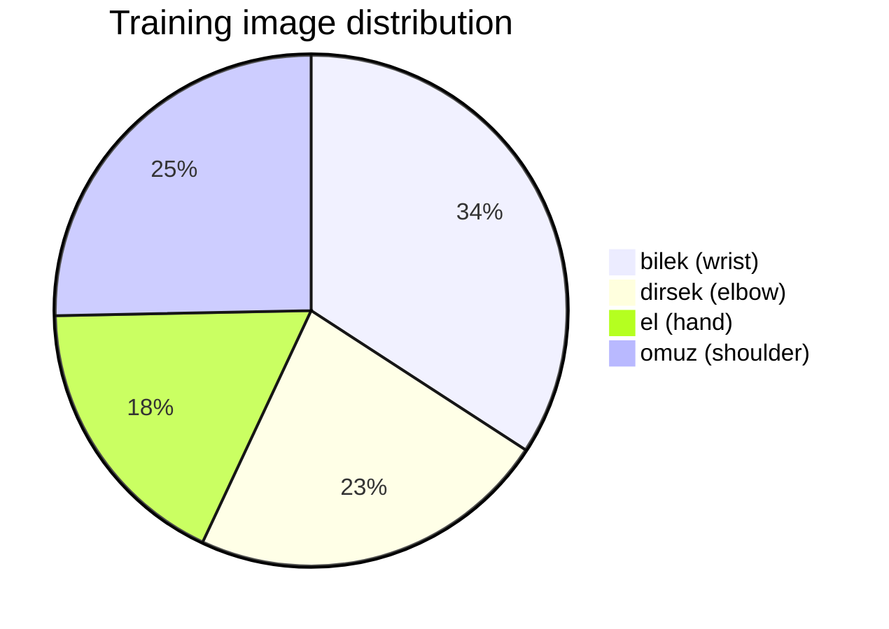
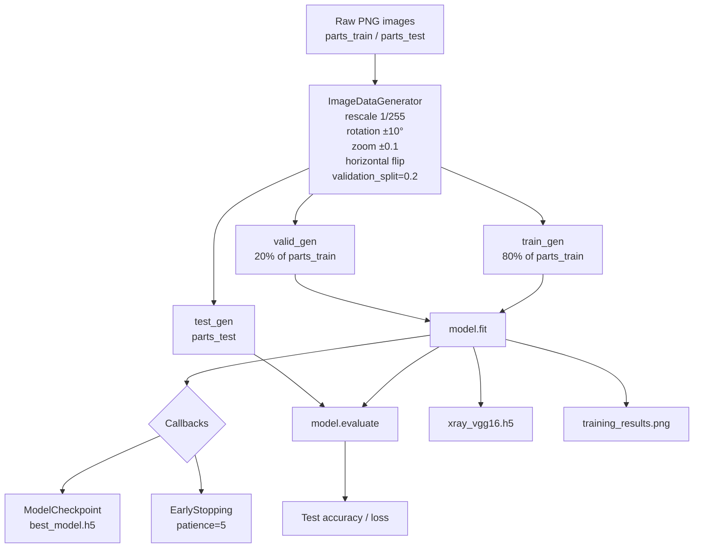
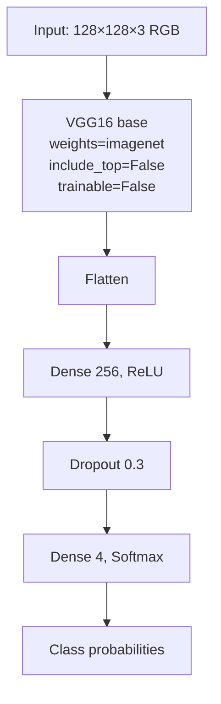
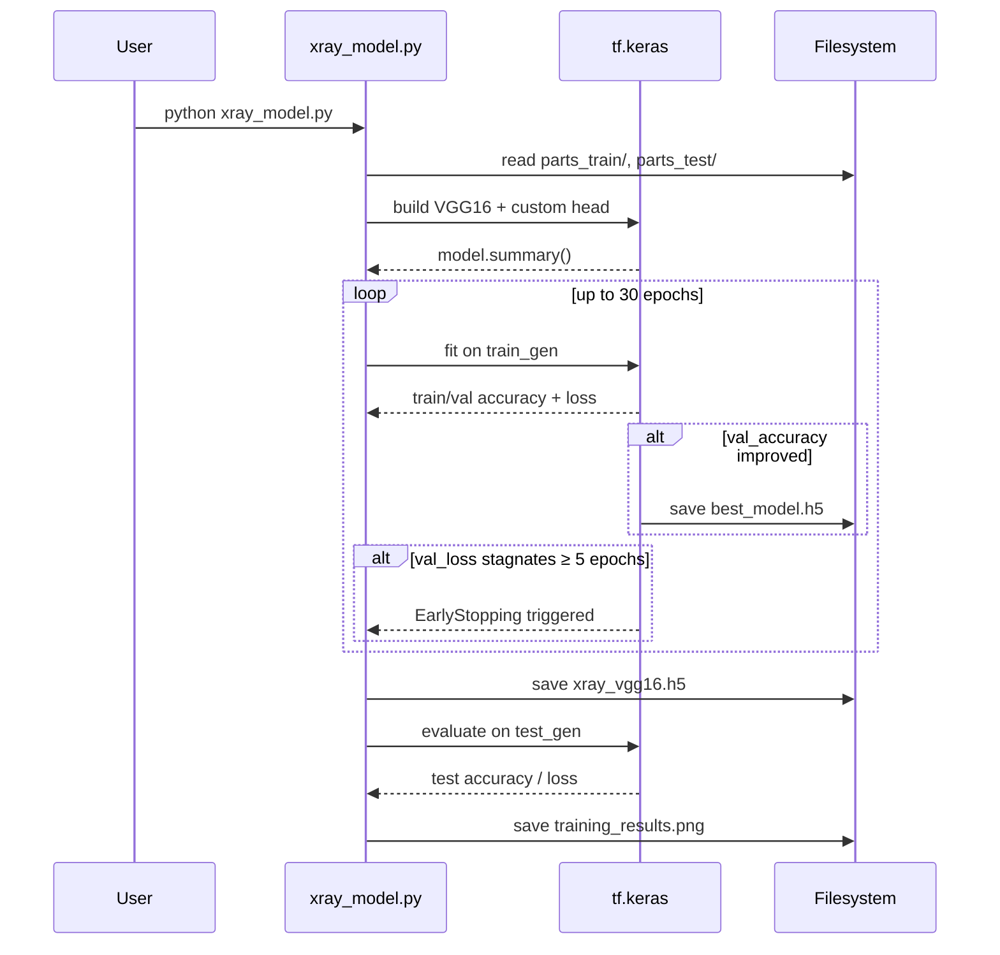
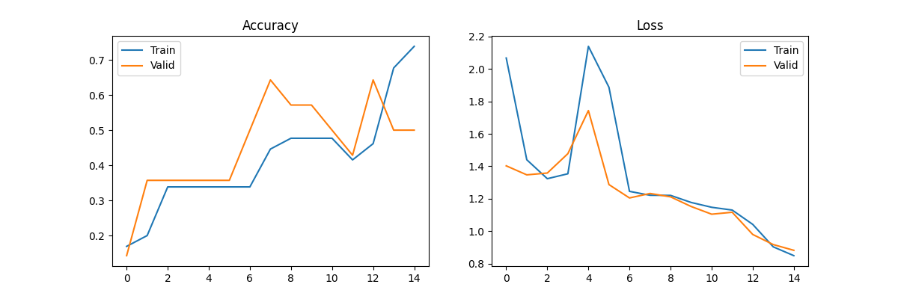
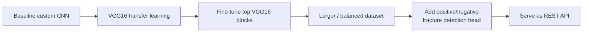

# xrayML — X-ray Body Part Classification

A deep-learning project that classifies grayscale musculoskeletal X-ray images into one of four body parts using **VGG16 transfer learning** in TensorFlow / Keras.

| Class (TR) | Class (EN) |
| ---------- | ---------- |
| `bilek`    | wrist      |
| `dirsek`   | elbow      |
| `el`       | hand       |
| `omuz`     | shoulder   |

---

## Table of contents

1. [Overview](#overview)
2. [Project structure](#project-structure)
3. [Dataset](#dataset)
4. [Pipeline](#pipeline)
5. [Model architecture](#model-architecture)
6. [Training workflow](#training-workflow)
7. [Getting started](#getting-started)
8. [Results](#results)
9. [Roadmap](#roadmap)

---

## Overview

The goal is to take a single X-ray image and predict which of the four anatomical regions it depicts. The repository ships two trained artifacts:

- `xray_model.h5` — initial baseline (custom 3-block CNN, grayscale).
- `xray_vgg16.h5` / `best_model.h5` — current model based on VGG16 transfer learning (RGB).



---

## Project structure

```
xrayML/
├── datasets/
│   ├── parts_train/         # training images, one folder per class
│   │   ├── bilek/
│   │   ├── dirsek/
│   │   ├── el/
│   │   └── omuz/
│   └── parts_test/          # held-out test images, same class folders
├── xray_model.py            # training script (VGG16 transfer learning)
├── xray_model.h5            # legacy custom-CNN weights
├── xray_vgg16.h5            # VGG16 final weights
├── best_model.h5            # best checkpoint by val_accuracy
├── training_results.png     # accuracy + loss curves
└── README.md
```



---

## Dataset

The images are organized into class-named subdirectories so Keras' `flow_from_directory` can infer labels automatically. Filenames follow `studyN_{positive|negative}_imageM.png`.

| Class    | Train images | Test images |
| -------- | -----------: | ----------: |
| bilek    |           27 |           8 |
| dirsek   |           18 |           7 |
| el       |           14 |           7 |
| omuz     |           20 |           5 |
| **Total**|       **79** |      **27** |

> The dataset is intentionally small — this project is set up for transfer learning and aggressive augmentation rather than training from scratch.



---

## Pipeline



---

## Model architecture

A frozen VGG16 ImageNet backbone is used as a feature extractor, followed by a small dense classification head.



**Compile config**

| Setting       | Value                       |
| ------------- | --------------------------- |
| Optimizer     | Adam, `lr=1e-4`             |
| Loss          | `categorical_crossentropy`  |
| Metric        | `accuracy`                  |
| Epochs (max)  | 30 (early-stopped)          |
| Batch size    | 32                          |
| Input shape   | 128 × 128 × 3               |

---

## Training workflow



---

## Getting started

### 1. Prerequisites

- Python 3.10+
- A working TensorFlow install (CPU is fine for this dataset size, GPU is faster)

### 2. Install dependencies

```bash
pip install tensorflow numpy matplotlib pillow
```

### 3. Configure dataset paths

`xray_model.py` currently uses hard-coded Windows paths:

```python
train_dir = r"D:\ProjectsD\Odev7\xray-env\datasets\parts_train"
test_dir  = r"D:\ProjectsD\Odev7\xray-env\datasets\parts_test"
```

Update these to point at the local `datasets/parts_train` and `datasets/parts_test` folders, e.g.:

```python
train_dir = "datasets/parts_train"
test_dir  = "datasets/parts_test"
```

### 4. Train

```bash
python xray_model.py
```

Outputs:

- `best_model.h5` — best checkpoint by validation accuracy
- `xray_vgg16.h5` — final weights at end of training
- `training_results.png` — accuracy / loss curves

### 5. Predict on a single image

```python
import numpy as np
from tensorflow.keras.models import load_model
from tensorflow.keras.preprocessing import image

CLASSES = ["bilek", "dirsek", "el", "omuz"]

model = load_model("best_model.h5")

img = image.load_img("path/to/xray.png", target_size=(128, 128), color_mode="rgb")
x = image.img_to_array(img) / 255.0
x = np.expand_dims(x, axis=0)

probs = model.predict(x)[0]
print(dict(zip(CLASSES, probs.tolist())))
print("Prediction:", CLASSES[int(np.argmax(probs))])
```

---

## Results

Training and validation curves are saved to `training_results.png` after each run:



The exact test accuracy is printed at the end of `xray_model.py` and depends on the random split.

---

## Roadmap



Planned next steps:

- Unfreeze the last VGG16 block and fine-tune at a smaller learning rate.
- Rebalance classes (currently `el` and `dirsek` are under-represented).
- Use the `study*_positive_*` / `study*_negative_*` filename convention to add a second head for **abnormality detection**, not just body-part classification.
- Wrap the trained model in a small FastAPI / Flask service for inference.
